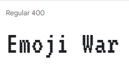

# **MID-TERM GAME PROJECT DOCUMENTATION** 🎨🔮✨ #

[LINK TO THE CURRENT VERSION](https://editor.p5js.org/batoxpr/sketches/Sliroo3bj)

//**GENERAL IDEA**
After getting a feedback on the dressup game idea, I decided to go for a completely different concept. The new game will be a "shoot 'em up" arcade game inspired by the classic Space Invaders. 

The name of the game is "Emoji war" and It'll be a battle game between Heart-eye emoji and Evil face emojis. The heart emoji will shoot bubbles to destroy the evil emoji army. I will use multiple animations and sounds to make the game more interesting. Because realized that there should be some sort of challenge to my game, I decided to go for this concept.

//**ASSETS**

* For the font, I've found the [one above](https://fonts.google.com/specimen/VT323?preview.text=Emoji%20War&preview.text_type=custom) from GoogleFonts library. 
I wanted to go for a pixelated retro gaming theme. Therefore, I thought it'd fit well.
* For the characters, I'm using the following two animations I've found from google
* 
* 

For the sounds, I've found the following, mainly from FreeSound.org:
* [win](https://freesound.org/people/Leszek_Szary/sounds/171671/)
* [lose](https://freesound.org/people/myfox14/sounds/382310/)
* [shoot](https://freesound.org/people/AlaskaRobotics/sounds/221091/)
* [kill](https://mixkit.co/free-sound-effects/game/)

//**START SCREEN**

* For the background image, I've found a pixelated room gif from google. 
Insert image here
* For the moving title, I made something similar to the example that was included in the Week 5 Github folder.
* For the blinking insruction text, I've used framecount and modulus to make it blink. 
Insert image here

//**CODING PROCESS**
I created different states for win and lose cases as well as a start screen and score counter. 
I used the KeyPressed() and KeyReleased() functions to make the emoji move and stop.
Insert image here.

//**ISSUES**
My audios were coming out distorted when I played them. i realized that it happens if I put the audios by themselves within the function or draw function.
I've found the solution from the following link.
https://discourse.processing.org/t/i-am-trying-to-load-in-a-sound-file-to-my-p5-sound-project-but-they-all-come-out-distorted-or-my-screen-goes-black/6121
