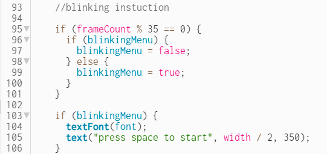
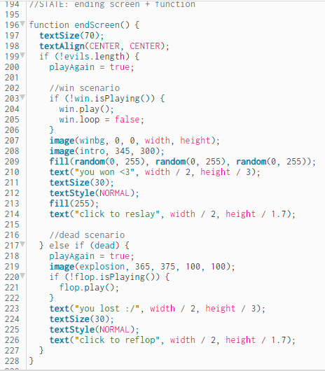
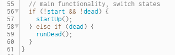
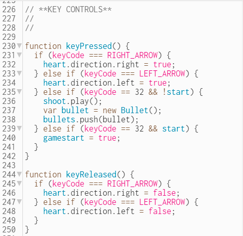

# **MID-TERM GAME PROJECT DOCUMENTATION** 🎨🔮✨ #

[Link to the Current version](https://editor.p5js.org/batoxpr/sketches/Sliroo3bj)

///**general concept & idea**///

After getting a feedback on the dressup game idea, I decided to go for a completely different concept. The new game will be a "shoot 'em up" arcade game inspired by the classic Space Invaders. 

The name of the game is "Emoji war" and It'll be a battle game between Heart-eye emoji and Evil face emojis. The heart emoji will shoot bubbles to destroy the evil emoji army. I will use multiple animations and sounds to make the game more interesting. Because I realized that there should be some sort of challenge to my game, I decided to go for this concept.

///**assets**///

* For the font, I've found the [one above](https://fonts.google.com/specimen/VT323?preview.text=Emoji%20War&preview.text_type=custom) from GoogleFonts library. 
I wanted to go for a pixelated retro gaming theme. Therefore, I thought it'd fit well.
* For the characters, I'm using the following two animations I've found from google

* For the sounds, I've found the following, mainly from FreeSound.org:
- [win](https://freesound.org/people/Leszek_Szary/sounds/171671/)
- [lose](https://freesound.org/people/myfox14/sounds/382310/)
- [shoot](https://freesound.org/people/AlaskaRobotics/sounds/221091/)
- [kill](https://mixkit.co/free-sound-effects/game/)

///**start screen**///

* For the background image, I've found this [pixelated room](https://i.pinimg.com/originals/50/3e/7b/503e7bdead9d16873dc3aba172bfd595.gif) gif from Pinterest. 
* For the moving title, I made something similar to the example that was [included](https://editor.p5js.org/itp42/sketches/X3BWWO3KO) in the Week 4 Github folder.
* For the blinking insruction text, I've used framecount and modulus to make it blink. 

///**coding process**///
* I first started to watch [The Coding Train's](https://www.youtube.com/watch?v=l0HoJHc-63Q) P5JS game tutorials. Then I also found multiple other tutorials including [Richard Middleton](https://www.richardmiddleton.me/projects/space-invaders/) and [CodeArt](https://www.youtube.com/watch?v=Z57hx4ey5RY&t=216s). From these examples, I've understood the basic concepts of switching from one state to another, and implementing key functions of P5JS to control the game.

* similar to the start screen, I created a separate ending state function (which includes win and lose cases).

* the main game's code + functionality are included within the draw function.

* I added two different animations for win and lose cases as you can see below. + [star fall bg](https://acegif.com/wp-content/gifs/starfall-gif-46.gif)

///**functions && constructors**///

* I used the KeyPressed() and KeyReleased() functions to make the emoji move,stop, and shoot. The left and right arrows are for moving the heart-eye. The space bar is for shooting a bullet.

* On top of these control functions, I used many other small functions as shown in this
*list: 
startUp, 
runDead, 
bulletFunc, 
evilFunc, 
scoreFunc, 
reset,
startGame, 
mousePressed*

* Most importantly, I made constructors for the three main objects: *evil, heart-eye, and bullet*
each constructor contains the appearance, sound and basic functionalities of the objects

* To learn about adding sounds, I've watched the [following tutorial from The Coding Train](https://www.youtube.com/watch?v=40Me1-yAtTc)

///**issues**///

* At first, I had many troubles with switching between the states and coding the small functions. However simple Google search, and the examples I mentioned above, particularly  Middleton & The Coding Train, helped me immensely. 

* At firts, my audios were coming out distorted when I uploaded them to P5. I tried them on different computers, and still experienced the same issue. Then i realized that it happens if I put the audios by themselves within the function or draw function.
I've found the solution from [the following link](https://discourse.processing.org/t/i-am-trying-to-load-in-a-sound-file-to-my-p5-sound-project-but-they-all-come-out-distorted-or-my-screen-goes-black/6121)
